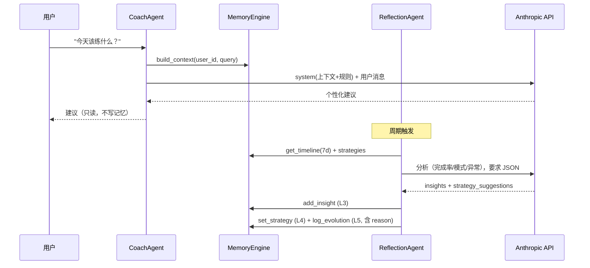

# Agents：Coach 与 Reflection 的职责边界

两个 Agent 都遵循 "Agent Second"：不直接读写数据库，一切经由 `core/memory.MemoryEngine`；
LLM 调用经由共享的 `agents/llm.py` 抽象（模型 `claude-sonnet-4-6`，API Key 来自
`ANTHROPIC_API_KEY`；无 Key 时自动降级为确定性的 `MockLLMClient`，便于离线开发与测试）。

## 职责对比

| | Coach Agent | Reflection Agent |
|---|---|---|
| 触发 | 用户消息（同步、对话式） | 周期任务 / 指定日期（异步、批处理式） |
| 输入 | `user_id` + 用户消息 | `user_id` + `date` |
| 读记忆 | `build_context()`：Profile + 7 天 Timeline + Top5 Insights + Strategies | `get_timeline(days=7)` + 当天日志 + 当前 Strategies |
| 写记忆 | **不写任何层** | Layer 3（insights）、Layer 4（strategies）、Layer 5（evolution_logs） |
| 输出 | 面向用户的建议文本 | `ReflectionReport`（写入的洞察与策略） |
| 输出形态 | 自由文本（要求具体、可执行、引用用户数据） | 严格 JSON（Pydantic 校验），解析失败即报错，不静默降级 |

## 边界规则

1. **Coach 只读，Reflection 只写提炼层。** Coach 绝不修改记忆——个性化建议的"记住"发生在
   用户实际执行并记录到 Timeline 之后。Reflection 绝不直接面向用户——它的产出进入记忆，
   由下一次 Coach 调用消费。
2. **策略变更必须留痕。** Reflection 建议调整策略时，除写入 Layer 4 外，必须向 Layer 5 写
   `strategy_adjusted_by_reflection`，携带 before/after 与模型给出的 `reason`——保证任何
   策略可解释、可回溯。
3. **证据约束。** Reflection 的 system prompt 要求洞察带证据、只在证据充分时建议策略；
   Coach 的 system prompt 要求引用用户自己的数据、不与 constraints 和现行策略冲突。
4. **Layer 5 不进 Agent 上下文。** 两个 Agent 都看不到 evolution_logs——那是系统对自身的
   记忆，由 evolution 模块消费。

## Mock 模式

`resolve_llm_client()`：`ANTHROPIC_API_KEY` 存在 → `AnthropicLLMClient`（真实 Messages API）；
否则 → `MockLLMClient`（记录调用、返回 canned/占位回复）。测试全部注入 mock，不发真实请求。
Agent 构造函数也接受显式 `llm=` 注入，便于单测精确控制"模型输出"。

## 数据流

