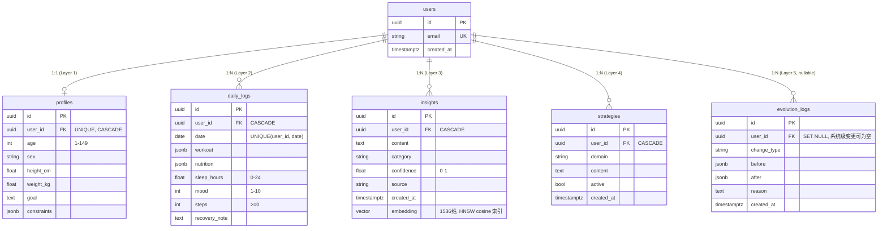

# ER 图

五层记忆的持久化 schema（迁移见 `database/migrations/versions/0001_initial_schema.py`）。

## 设计要点

- **约束下沉到数据库**：mood 1-10、confidence 0-1、sleep 0-24 等既在 Pydantic 校验，也以 CHECK 约束落库——任何绕过应用层的写入同样受约束（Data First）。
- **`daily_logs` 每用户每天一行**（`UNIQUE(user_id, date)`），日内多事件在 `workout`/`nutrition` JSONB 内累积，保持 Layer 2 append-only 语义。
- **`insights.embedding`**：`vector(1536)` + HNSW 余弦索引，支撑 `core/memory` 的语义召回。
- **`evolution_logs.user_id` 可空**（`ON DELETE SET NULL`）：系统级演进不绑定用户，且用户删除后演进记录仍保留供回放。
