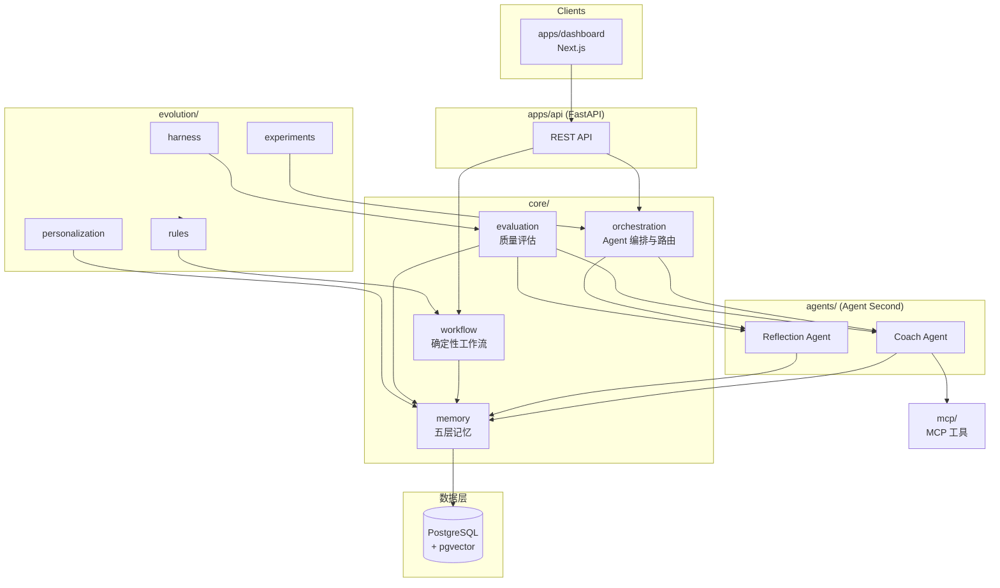

# 架构总览

## 设计原则

**Data First → Memory First → Workflow First → Evolution First → Agent Second**

Agent 是最后接入的一层：只有当数据模型、记忆系统、确定性工作流与演进机制都成立时，Agent 才在其上做决策与表达。这保证系统可测试、可解释——大部分行为由确定性组件产生，LLM 只负责需要判断与语言的环节。

## 整体架构图

## 模块职责

| 模块 | 职责 |
|---|---|
| `apps/api` | HTTP 适配层。校验请求、调用 core、序列化响应。不含领域逻辑。 |
| `apps/dashboard` | 用户界面：Timeline 视图、建议卡片、洞察报告。 |
| `agents/coach` | 主动教练：读取记忆 → 生成当日建议与计划调整。 |
| `agents/reflection` | 周期复盘：分析 Timeline → 提炼 Insights 写回记忆。 |
| `core/memory` | 五层记忆（Profile / Daily Timeline / Insights / Strategy / Evolution）的读写接口与检索（含向量检索）。见 ADR-0002。 |
| `core/workflow` | 确定性工作流：数据摄入、日程触发、记忆整理等不需要 LLM 的流程。 |
| `core/orchestration` | 决定何时唤起哪个 Agent、注入什么上下文、如何处理输出。 |
| `core/evaluation` | 评估 Agent 输出与记忆质量，为 evolution 提供信号。 |
| `evolution/harness` | 回放与基准测试框架，验证系统改动不退化。 |
| `evolution/rules` | 从评估信号中沉淀的可执行规则。 |
| `evolution/personalization` | 按用户维度调整策略参数。 |
| `evolution/experiments` | A/B 与策略实验的定义与追踪。 |
| `mcp/` | 对外暴露/接入的 MCP 工具（如穿戴设备数据源）。 |
| `models/` | Pydantic/SQLAlchemy 领域模型，全系统共享的 schema 真相源。 |
| `database/` | Alembic 迁移、种子数据。 |
| `analytics/` | 指标计算与离线分析。 |

## 数据流

1. **摄入**：用户或设备数据经 REST API → `core/workflow` 校验、归一化 → 写入 Daily Timeline（PostgreSQL）。
2. **建议**：定时或用户触发 → `core/orchestration` 组装上下文（Profile + 近期 Timeline + 相关 Insights，经 pgvector 检索）→ Coach Agent 生成建议 → 经 evaluation 记录 → 返回用户并落库。
3. **复盘**：周期任务触发 Reflection Agent → 读取一段时间的 Timeline → 产出 Insights 写回记忆第三层。
4. **演进**：`core/evaluation` 持续给建议/洞察打分 → `evolution/harness` 回放验证 → 沉淀为 `rules` 与 `personalization` 参数 → 反哺 workflow 与 orchestration。

每一步的中间产物都持久化，保证任意建议可追溯到其依据的数据与记忆——**可解释**由数据流设计保证，而非事后补救。
